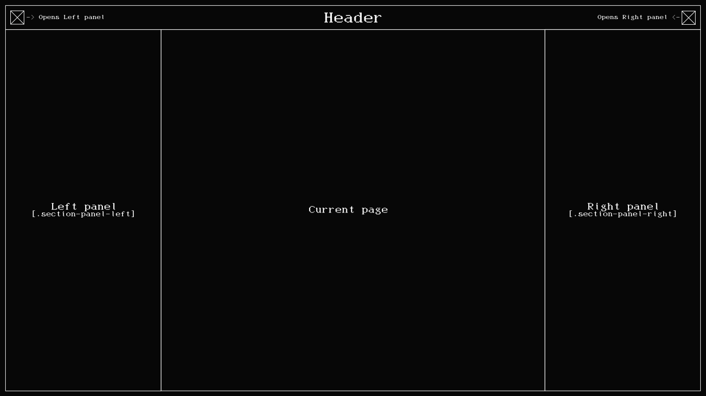

# Design considerations
Humans have an innate understanding for common, predictable and repeatable concepts. Our brains are, in fact, hardwired 
to take advantage of such phenomena. Patterns emerge when concepts and actions, interlinked, construct a predictable outcome.
This basic idea should always be employed into the design of a user interface, because it inherently supplies an innate 
understanding of user interaction.

So, just bear this in mind. Try not to reinvent HTML elements, use them properly.

The designer docs are intended to help out in the development processes of both the Core components, and Plugins. 
With an emphasis on the frontend side of things, of course.

## Basic layout
_Bear in mind **any** of the following assumptions are based upon the **default theme**, your mileage may vary._

The layout is subdivided in 4 distinct areas:
- **Header**
  - Left panel ~~checkbox~~ button :)
  - **Left panel**
  - Main instance link / header 1
  - Right panel ~~checkbox~~... I mean, button...
  - **Right panel**
- **Current page content**

Each one of these areas **are selectable** with CSS by **using a limited set of classes**. You can use whatever classes 
you may want, but bear in mind that any external code made by someone else other than yourself may not account 
for your specific class names.

### CSS classes reference

| Name                 | Function                                                                   | Dependencies                                     | Examples                                                                                                                                             | Sub-classes                                       |
|----------------------|----------------------------------------------------------------------------|--------------------------------------------------|------------------------------------------------------------------------------------------------------------------------------------------------------|---------------------------------------------------|
| section-panel        | Side panel                                                                 | - Preceded by a checkbox hack (hide/show panel); | Left panel `\App\Component\LeftPanel\templates\left_panel\view.html.twig` Right `\App\Component\RightPanel\templates\right_panel\view.html.twig` | `section-panel-left`, `section-panel-right`       |
| section-widget       | A sub-section of a page, commonly a template block of a component / plugin | None                                             | Login template `\App\templates\security\login.html.twig`                                                                                             | `section-widget-title`, `section-widget-subtitle` |
| section-widget-title | A template block's title                                                   | - Part of a `section-widget`;                    | Settings template `\App\templates\settings\base.html.twig`                                                                                           | None                                              |

_**still in construction...**_